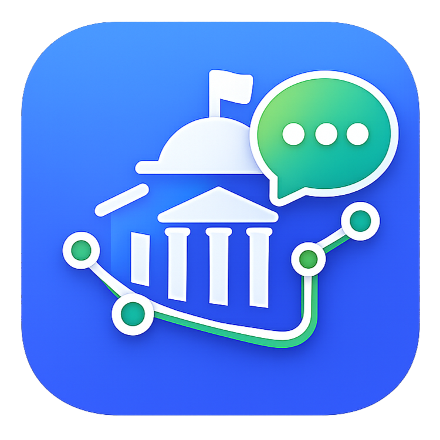
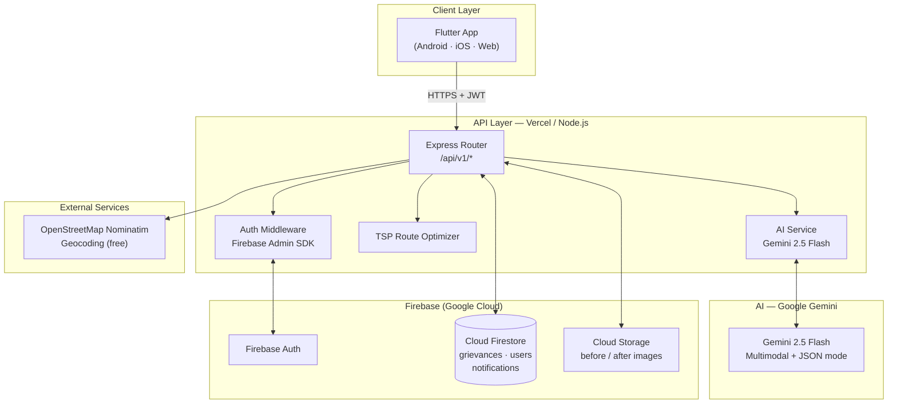
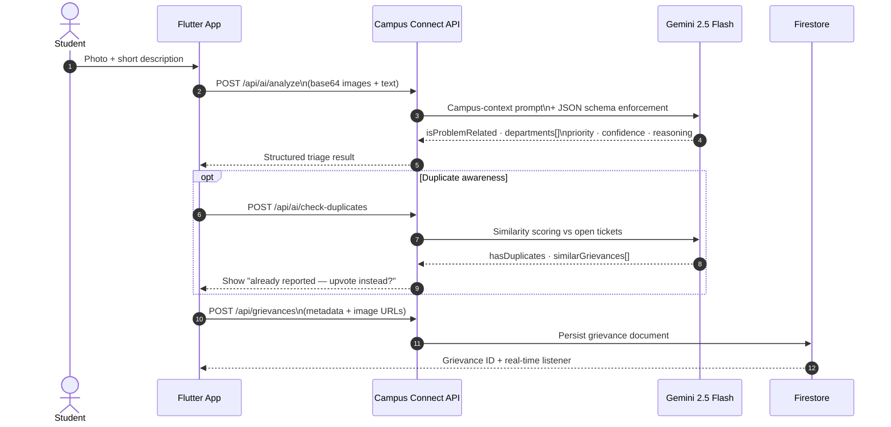
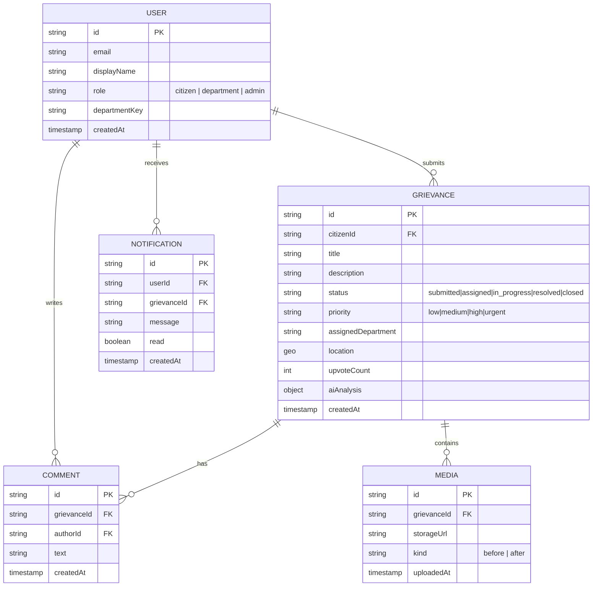

<div align="center">



# Campus Connect

### AI-Powered Campus Grievance Management System

[](https://flutter.dev)
[](https://nodejs.org)
[](https://firebase.google.com)
[](https://ai.google.dev)
[](https://vercel.com)
[](LICENSE)

> **Snap. Describe. Submit.** Campus Connect uses a multimodal AI triage agent to automatically classify infrastructure issues, route them to the right department, detect duplicates, and track resolution — end to end.

[Features](#-features) • [Architecture](#-architecture) • [AI Agent Design](#-ai-agent-design) • [Tech Stack](#-tech-stack) • [API Reference](#-api-reference) • [Quick Start](#-quick-start) • [Screenshots](#-screenshots)

</div>

---

## The Problem

University campuses face a constant stream of infrastructure complaints — broken lights, water leaks, garbage, road damage — but reporting is fragmented:

- Students don't know **which department** handles which issue
- Staff manually **re-read and re-route** every ticket
- **Duplicate reports** clutter queues and waste responder time
- There is **zero transparency** after submission

---

## The Solution

Campus Connect provides a **single mobile channel** where:

1. A student **takes a photo** and writes a short description
2. A **Gemini 2.5 Flash multimodal agent** classifies the issue, assigns departments, sets priority, checks for duplicates, and returns structured JSON
3. The right department **sees it instantly** — organized, prioritized, deduplicated
4. The student **tracks every status change** with before/after photo proof

---

## Features

| Area | Capability |
|------|-----------|
| **AI Triage** | Multimodal analysis (image + text), campus-aware prompt, JSON output with `isProblemRelated`, department(s), priority, confidence, reasoning |
| **Duplicate Detection** | AI-powered `/api/ai/check-duplicates` prevents re-submission of the same issue |
| **Smart Feed** | Multi-factor ranking: priority weight + upvote count + recency — like social media, but for infrastructure |
| **Full Lifecycle** | Submitted → Assigned → In Progress → Resolved, with comment threads and before/after photos |
| **Route Optimization** | TSP-based field worker routing reduces travel distance by ~38% |
| **Role-Based Access** | Citizen · Department · Admin — each with a tailored view |
| **Real-time Notifications** | Push alerts on every status change |
| **Offline-Aware** | Two-tier LRU+TTL cache; app loads instantly even on slow campus Wi-Fi |

---

## Architecture



---

## AI Agent Design

Campus Connect implements a **perception → reason → act** agentic loop:



### What makes it "agentic"

| Agentic property | Implementation |
|-----------------|---------------|
| **Perceive** | Multimodal input: camera images + free-text description |
| **Reason** | Campus-specific system prompt with department ontology, priority rubric, spam detection |
| **Structured output** | `responseMimeType: "application/json"` — output drives routing, not just display |
| **Guardrails** | Explicit rules: conservative `urgent`, reject off-topic images, confidence scoring |
| **Act** | JSON fields directly trigger: department assignment, priority queue placement, duplicate suppression, notification dispatch |
| **Memory (short-term)** | Two-tier LRU+TTL cache; duplicate check uses existing Firestore records as context |

---

## Tech Stack

### Frontend — Flutter 3.x

| Package | Purpose |
|---------|---------|
| `flutter_riverpod` | Reactive state management |
| `go_router` | Declarative navigation |
| `dio` | HTTP client with interceptors |
| `flutter_map` | Leaflet-style interactive maps |
| `firebase_auth` + `cloud_firestore` | Auth and real-time data |
| `image_picker` + `flutter_image_compress` | Camera capture, 70% size reduction |
| `geolocator` | GPS location capture |
| `flutter_local_notifications` | Push/local alerts |

### Backend — Node.js 18 + Express

| Package | Purpose |
|---------|---------|
| `@google/generative-ai` | Gemini API SDK |
| `firebase-admin` | Server-side Firestore + Auth |
| `multer` + `sharp` | Image upload + processing |
| `zod` | Request validation |
| `cors` + `dotenv` | Security and config |

### Infrastructure

| Service | Role |
|---------|------|
| Firebase Auth | JWT-based multi-role authentication |
| Cloud Firestore | Primary database |
| Cloud Storage | Image hosting (before / after) |
| Vercel | Serverless API deployment |
| OpenStreetMap Nominatim | Free geocoding |

---

## Data Model



---

## API Reference

Base URL: `https://<your-vercel-deployment>/api/v1`

### AI Endpoints

| Method | Endpoint | Description |
|--------|----------|-------------|
| `POST` | `/ai/analyze` | Multimodal grievance classification |
| `POST` | `/ai/check-duplicates` | Similarity check against existing tickets |
| `POST` | `/ai/analyze-priority` | Priority-only quick analysis |

**`POST /ai/analyze` — request body**
```json
{
  "title": "Broken street light near hostel block C",
  "description": "The lamp has been out for 3 days",
  "images": ["<base64>"]
}
```

**Response**
```json
{
  "success": true,
  "data": {
    "isProblemRelated": true,
    "suggestedTitle": "Street light outage near Hostel Block C",
    "suggestedDepartments": ["Electrical Department"],
    "suggestedPriority": "medium",
    "confidence": 0.92,
    "reasoning": "Image shows a non-functioning lamp post at night..."
  },
  "processingTime": 1240
}
```

### Grievance Endpoints

| Method | Endpoint | Auth | Description |
|--------|----------|------|-------------|
| `POST` | `/grievances` | Citizen | Create grievance |
| `GET` | `/grievances` | Any | List with filters |
| `GET` | `/grievances/:id` | Any | Single grievance |
| `PATCH` | `/grievances/:id/status` | Dept/Admin | Update status |
| `POST` | `/grievances/:id/upvote` | Citizen | Upvote |
| `POST` | `/grievances/optimize-routes` | Dept | TSP route optimization |
| `GET/POST` | `/grievances/:id/comments` | Any | Comment thread |

### Other Endpoints

`/auth/*` · `/users/*` · `/notifications/*` · `/location/*` · `/config` · `/campus-locations/*`

Full docs: [`backend/ENDPOINTS_SUMMARY.md`](backend/ENDPOINTS_SUMMARY.md)

---

## Quick Start

### Prerequisites
- Node.js ≥ 18
- Flutter ≥ 3.0
- Firebase project with Firestore, Auth, Storage enabled
- Google Gemini API key ([get one free](https://ai.google.dev))

### 1. Backend

```bash
cd backend
cp .env.example .env   # fill in keys
npm install
npm run dev            # http://localhost:3000
```

`.env` keys needed:
```
GEMINI_API_KEY=
FIREBASE_PROJECT_ID=
FIREBASE_PRIVATE_KEY=
FIREBASE_CLIENT_EMAIL=
FRONTEND_URL=http://localhost:3000
```

### 2. Flutter App

```bash
cd frontend
flutter pub get
# Edit lib/config/api_config.dart → set your backend URL
flutterfire configure   # links Firebase
flutter run
```

### 3. Verify

```bash
curl https://localhost:3000/api/health
# {"status":"ok","message":"Campus Connect API is running"}
```

---

## Project Status

| Layer | Status |
|-------|--------|
| Backend API (20+ endpoints) | Complete |
| AI triage + duplicate detection | Complete |
| TSP route optimization | Complete |
| Flutter auth + navigation | Complete |
| Flutter grievance submission | In progress |
| Flutter map + route view | In progress |
| Analytics dashboard | Planned |

---

## Folder Structure

```
campus-connect/
├── backend/
│   ├── api/
│   │   ├── index.js              # Express entry, versioned routes
│   │   ├── routes/               # grievances, ai, auth, users, ...
│   │   ├── services/
│   │   │   ├── aiService.js      # Gemini integration
│   │   │   ├── tspService.js     # Route optimization
│   │   │   └── firebaseService.js
│   │   ├── middleware/auth.js
│   │   └── config/departments.js
│   └── package.json
├── frontend/
│   ├── lib/
│   │   ├── screens/              # landing, auth, home, grievance, map ...
│   │   ├── providers/            # Riverpod state
│   │   ├── services/             # api_service, config_service, cache
│   │   ├── widgets/              # design system components
│   │   └── main.dart
│   └── pubspec.yaml
└── documentation/                # architecture, proposal, publication
```

---

## Why This Matters for Agentic AI

Campus Connect is a production-grade example of an **agentic perception-reasoning-action loop** embedded in a real civic workflow:

- **Not a chatbot** — AI output is machine-readable JSON that directly drives routing, queuing, and deduplication
- **Domain-grounded prompt** — system prompt encodes campus structure (9000+ students, hostels, hospital, mess) for accurate department routing
- **Graceful degradation** — explicit fallback when AI response cannot be parsed; confidence score surfaces uncertainty to the user
- **Composable** — `/check-duplicates` and `/analyze-priority` are separate AI micro-calls that can be chained or called independently

---

## Contributing

PRs are welcome! Please open an issue first for large changes.

```bash
git checkout -b feature/your-feature
git commit -m "feat: describe your change"
git push origin feature/your-feature
```

---

## License

MIT © 2026 Suryaraj

---

<div align="center">

Built with purpose for smarter campuses.

**[View Live API](https://campus-connect-api.vercel.app/api/health)** • **[Documentation](documentation/)** • **[Backend Endpoints](backend/ENDPOINTS_SUMMARY.md)**

</div>
