# Campus Connect - Mermaid Diagrams

## 1. System Architecture Diagram

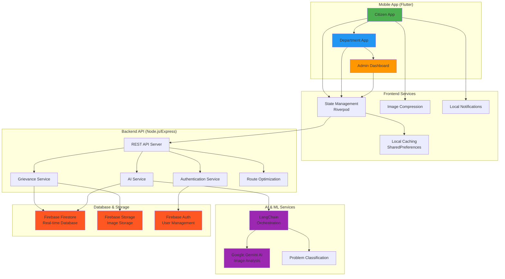

---

## 2. Feed Algorithm Flow Diagram

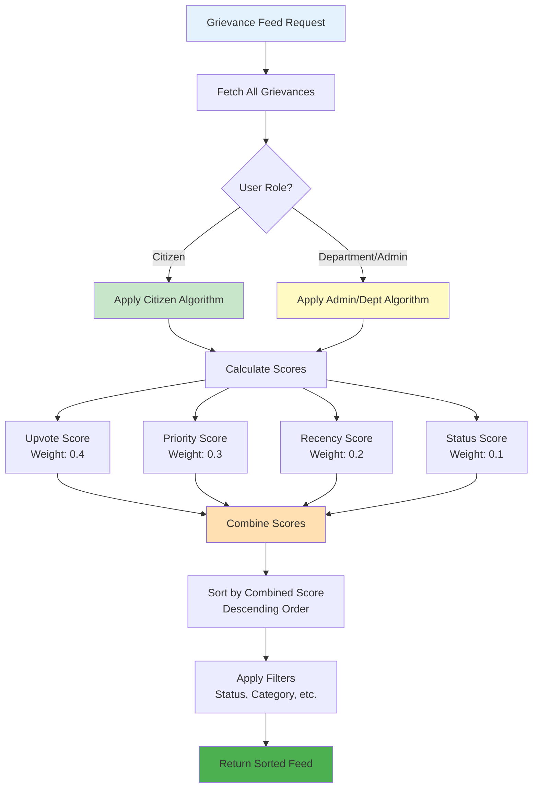

---

## 3. Feed Algorithm Scoring Visualization

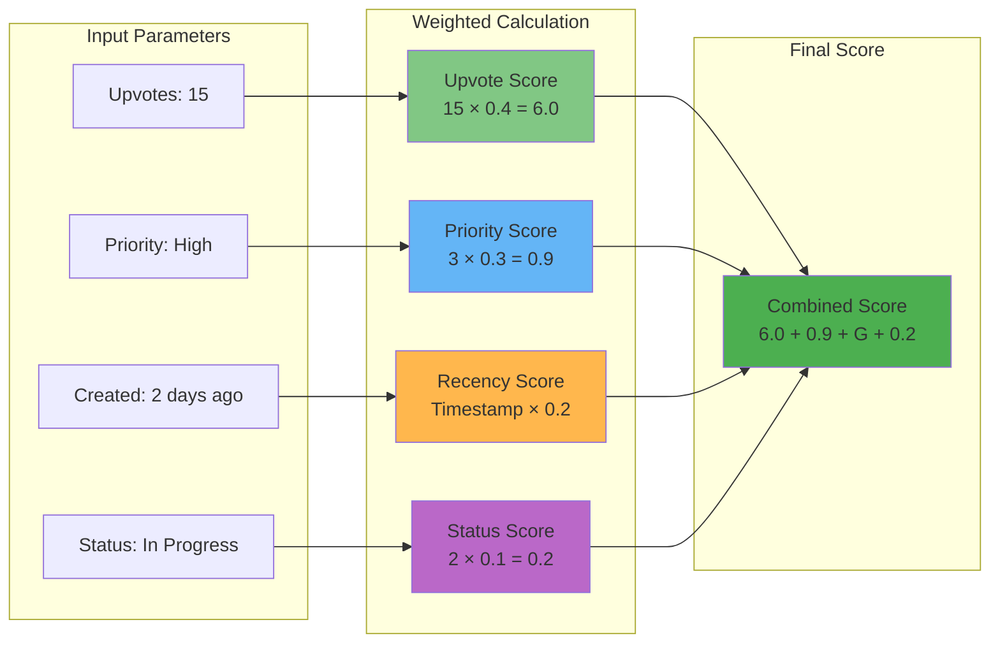

---

## 4. TSP Route Optimization Flow

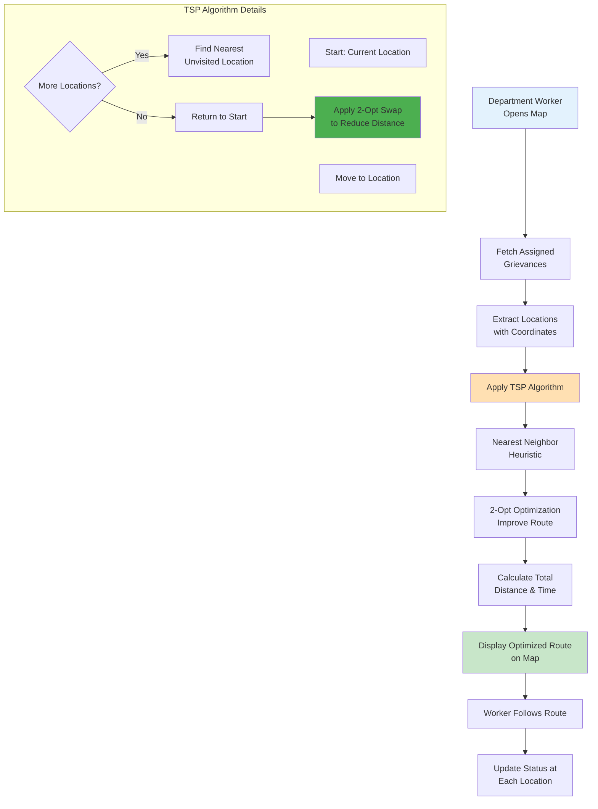

---

## 5. TSP Route Comparison

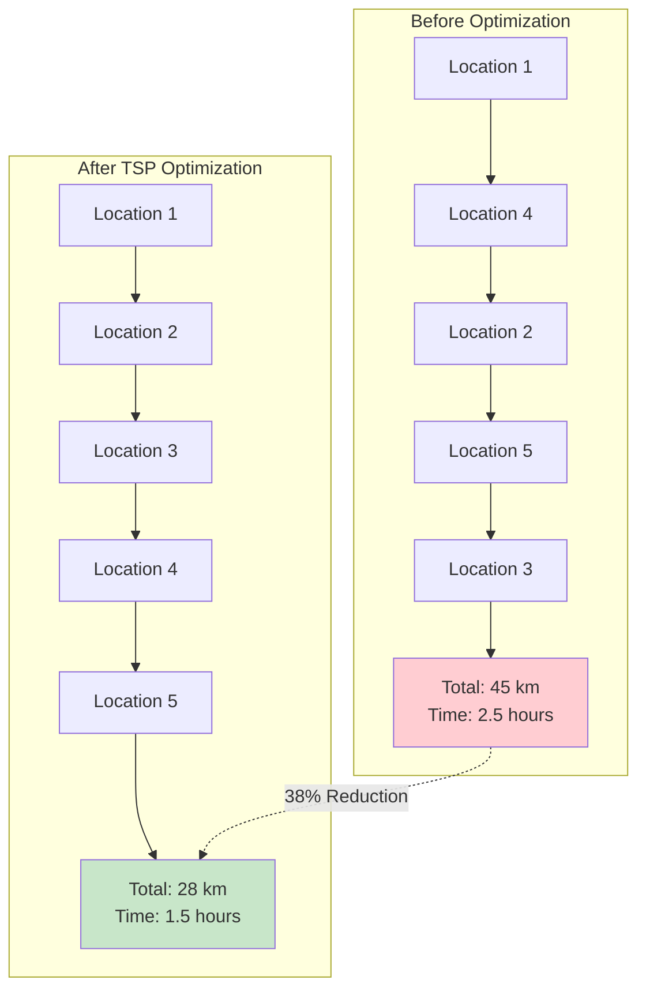

---

## 6. Two-Tier Caching Strategy

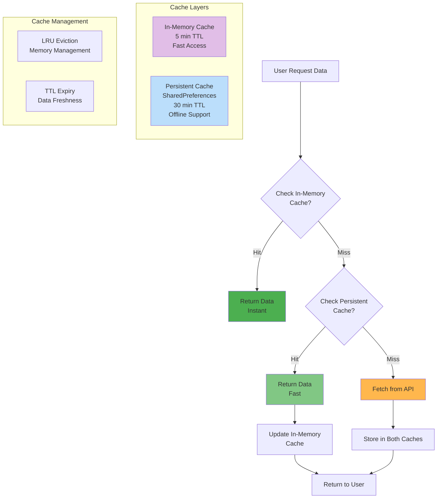

---

## 7. AI Problem Classification Flow

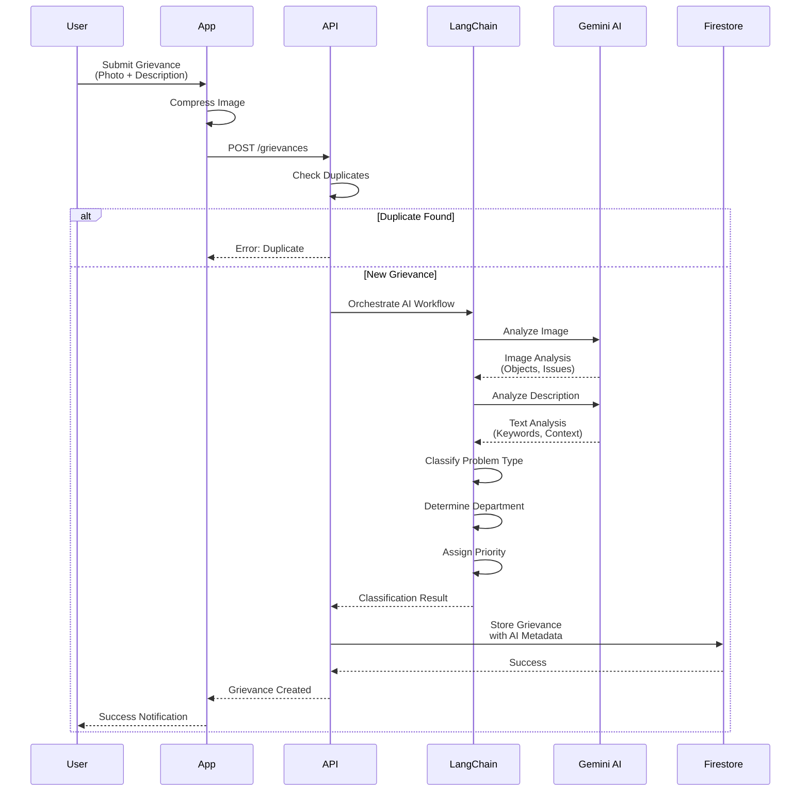

---

## 8. User Journey Flow

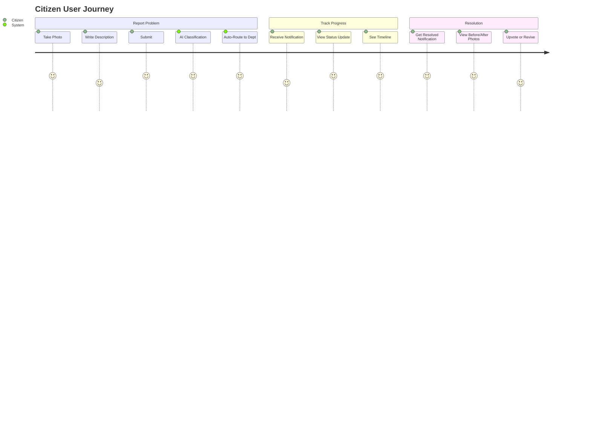

---

## 9. Department Worker Flow

```mermaid
flowchart LR
    A[Login as<br/>Department] --> B[View Dashboard]
    B --> C[See Assigned<br/>Grievances]
    C --> D[Filter by<br/>Priority/Status]
    D --> E[Click Optimize<br/>Routes]
    E --> F[TSP Algorithm<br/>Calculates Route]
    F --> G[View Route on Map]
    G --> H[Start Working]
    H --> I[Update Status:<br/>In Progress]
    I --> J[Visit Locations]
    J --> K[Fix Problems]
    K --> L[Upload After Photos]
    L --> M[Mark as Resolved]
    M --> N[Citizens Notified]
    
    style A fill:#2196F3
    style F fill:#FFE0B2
    style M fill:#4CAF50
```

---

## 10. Duplicate Detection Algorithm

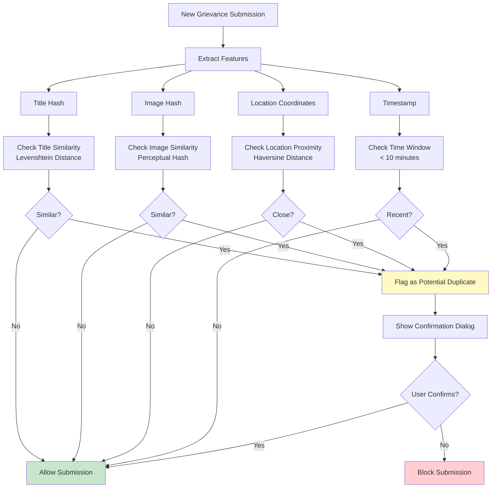

---

## 11. Status Timeline Flow

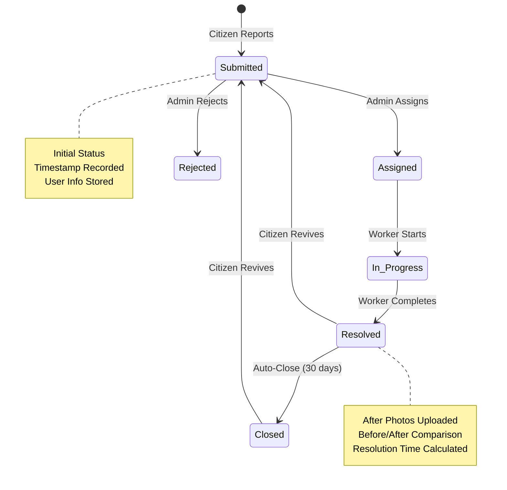

---

## 12. Complete System Data Flow

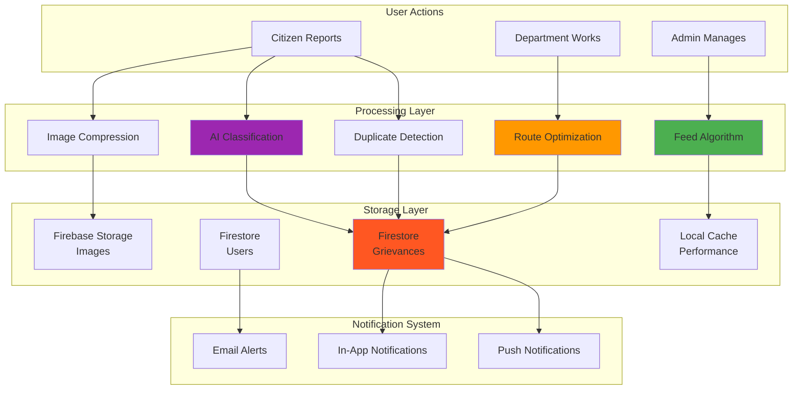

---

## 13. Performance Optimization Architecture

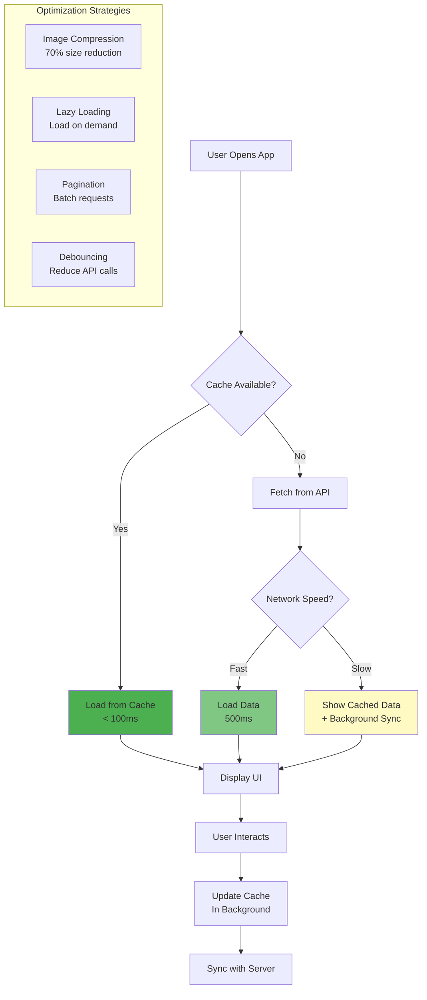

---

## 14. AI Orchestration with LangChain

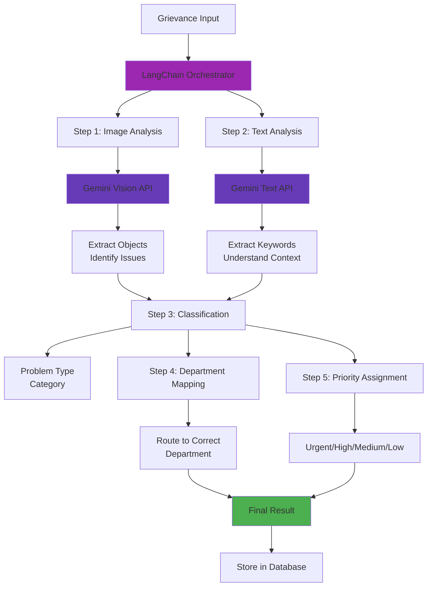

---

## 15. Role-Based Access Control

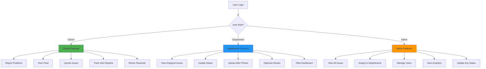

---

## How to Use These Diagrams

### For LinkedIn:
1. Copy the Mermaid code
2. Use online tools like:
   - [Mermaid Live Editor](https://mermaid.live/)
   - [GitHub Gists](https://gist.github.com/) (GitHub renders Mermaid)
   - [Notion](https://notion.so) (supports Mermaid)
   - [Obsidian](https://obsidian.md/) (supports Mermaid)

### For Documentation:
- GitHub automatically renders Mermaid in `.md` files
- Many documentation platforms support Mermaid
- Can be exported as PNG/SVG from Mermaid Live Editor

### For Presentations:
1. Use Mermaid Live Editor to generate images
2. Export as PNG (high resolution)
3. Insert into PowerPoint/Google Slides

### Recommended Diagrams for LinkedIn Post:
- **Diagram #2**: Feed Algorithm Flow (shows algorithm thinking)
- **Diagram #4**: TSP Route Optimization (shows practical algorithm application)
- **Diagram #6**: Two-Tier Caching (shows data structure application)
- **Diagram #1**: System Architecture (shows overall technical depth)

### Tips:
- Use 1-2 diagrams per post (don't overwhelm)
- Add a caption explaining what the diagram shows
- Mention "Built using Mermaid diagrams" to show attention to detail
- Link to your GitHub if you have the diagrams there

